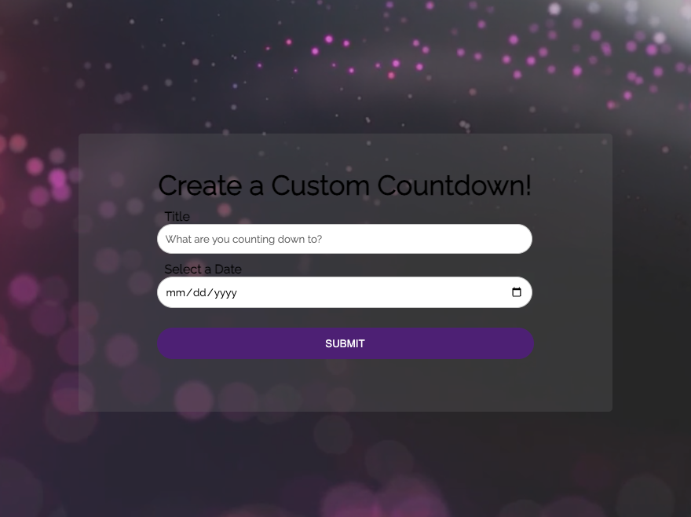

# Event-Countdown-Timer


A simple countdown timer created using JavaScript, HTML, and CSS. This project allows you to set a title and a specific date, and it will count down the time remaining until that date and time is reached.

## Table of Contents

- [Demo](#demo)
- [Features](#features)
- [Getting Started](#getting-started)
  - [Prerequisites](#prerequisites)
  - [Installation](#installation)
- [Usage](#usage)
- [Customization](#customization)
- [Contributing](#contributing)

## Demo

You can see a live demo of the countdown timer [here](https://lindakw.github.io/Event-Countdown/).



## Features

- Set a specific title for the event.
- Set a specific date using the calendar pop-up or enter a date.
- Displays days, hours, minutes, and seconds remaining.
- Clean and responsive design.

## Getting Started

Follow these instructions to get the countdown timer up and running on your local machine.

### Prerequisites

You need a modern web browser that supports JavaScript, such as Chrome, Firefox, or Edge.

### Installation

1. Clone the repository to your local machine using this command:

   ```bash
   git clone https://github.com/lindakw/Event-Countdown.git
   ```

2. Navigate to the project directory:

   ```bash
   cd Event-Countdown
   ```

## Usage

1. Open the `index.html` file in your web browser.

2. In the web page that opens, you will see the countdown timer and a form to set the countdown target date and time.

3. Enter the event and the date you want to countdown to.

4. Click the "Submit" button.

The timer will start counting down to the specified date, displaying the remaining days, hours, minutes, and seconds.

## Customization

You can customize the countdown timer's appearance and behavior by modifying the CSS and JavaScript files. Here are some things you can customize:

- Colors, fonts, and styles in the CSS file (`styles.css`).
- Countdown duration and target date in the JavaScript file (`script.js`).
- Add additional functionality or features to the countdown timer.

Feel free to explore the code and make it your own!

## Contributing

If you'd like to contribute to this project, please follow these steps:

1. Fork the repository.

2. Create a new branch for your feature or bug fix: `git checkout -b feature/my-feature` or `git checkout -b bugfix/fix-issue`.

3. Make your changes and commit them: `git commit -m "Description of changes"`

4. Push your changes to your forked repository: `git push origin feature/my-feature`.

5. Open a pull request on the original repository and describe your changes.

We welcome contributions from the community!

---

Enjoy using the Countdown Timer! If you have any questions or encounter any issues, feel free to open an issue in the GitHub repository.
